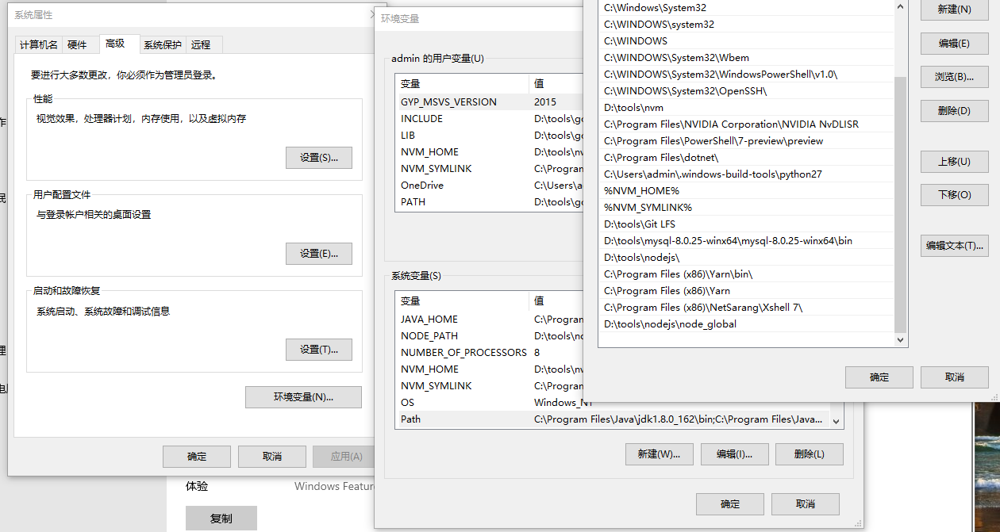

##  查询自己电脑内npm安装的所有包
> npm list -g --depth=0

这种情况适用于当你发现明明全局安装了某个安装包,当你使用的时候电脑还是提示, command not found,例如我昨天就发现了自己的安装包失效,碰到这种情况可以两步解决

- 先看看自己电脑有没有这个安装包,一般全局包都放在一个目录下,例如我的安装包就放在`D:\tools\nodejs\node_global`
- 然后查看自己电脑的环境变量,把nodejs全局包的路径放在,path里

  

环境以及路径没有问题的话,应该可以看到类似下面的结果

```js
+-- @nestjs/cli@8.0.2
+-- cnpm@6.2.0
+-- docsify-cli@4.4.3
+-- dva-cli@0.10.1
+-- electron@8.0.0
+-- express@4.17.1
+-- generator-theia-extension@0.1.24
+-- mirror-config-china@2.5.1
+-- node-gyp@8.1.0
+-- npm@7.24.2
+-- windows-build-tools@
+-- yarn@1.22.15
`-- yo@4.2.0
```

## 管理nodejs版本的工具

* mac平台可以使用 `n`
  * 使用方法就是`n install [node_vsersion]`,`n use [node_version]`,填上合适的node 版本就好
* windows平台我使用的是`nvm`
  * 使用方法就是`nvm install [node_vsersion]`,`nvm use [node_version]`,填上合适的node 版本就好
* linux平台

下载nvm:
```shell
wget -qO- https://raw.githubusercontent.com/nvm-sh/nvm/v0.39.1/install.sh | bash

#编辑~/.bash_profile等
#https://github.com/nvm-sh/nvm#troubleshooting-on-linux
export NVM_DIR="$([ -z "${XDG_CONFIG_HOME-}" ] && printf %s "${HOME}/.nvm" || printf %s "${XDG_CONFIG_HOME}/nvm")"
[ -s "$NVM_DIR/nvm.sh" ] && \. "$NVM_DIR/nvm.sh" # This loads nvm
```
## npm的命令使用技巧

### 搜索某个package的所有信息

```shell
npm view <package> versions
```

#### 搜索某个package的所有依赖关系

```shell
npx npm-remote-ls [package name]
```